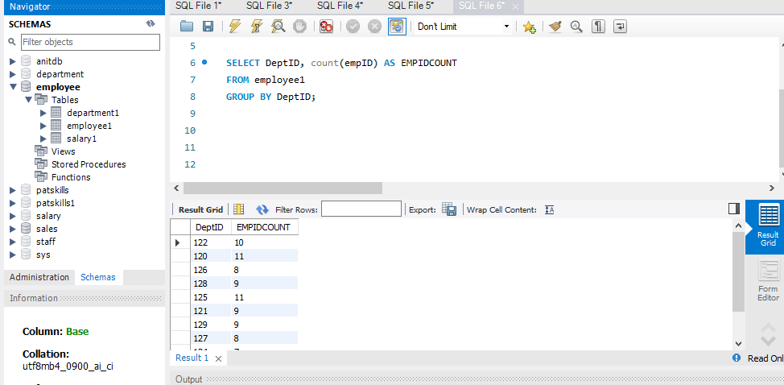
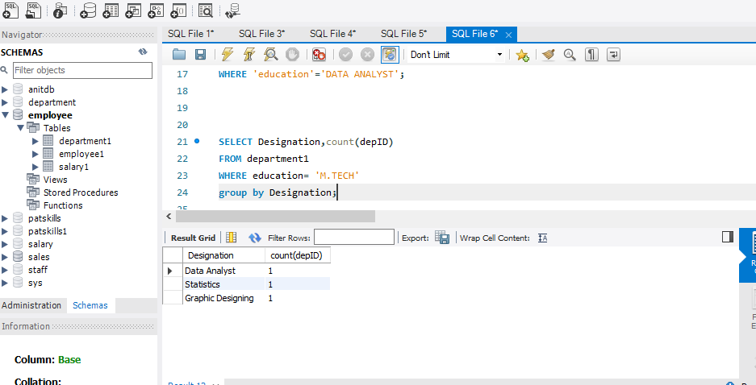
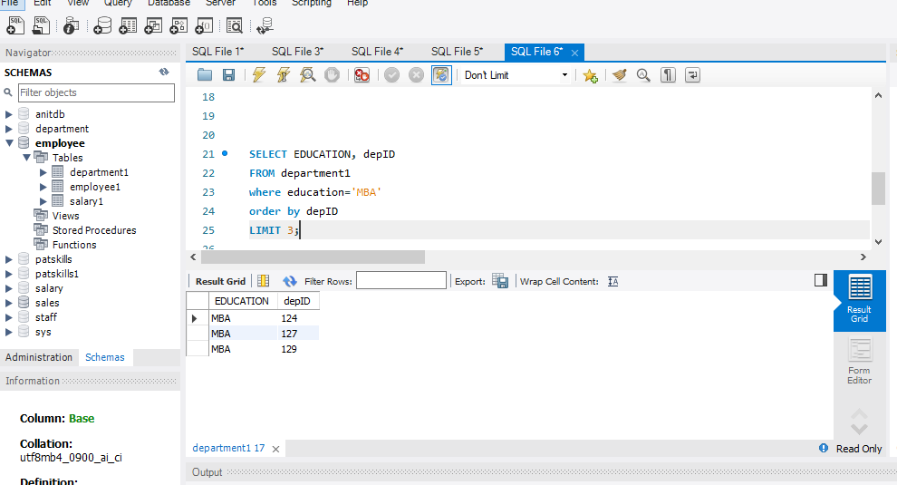
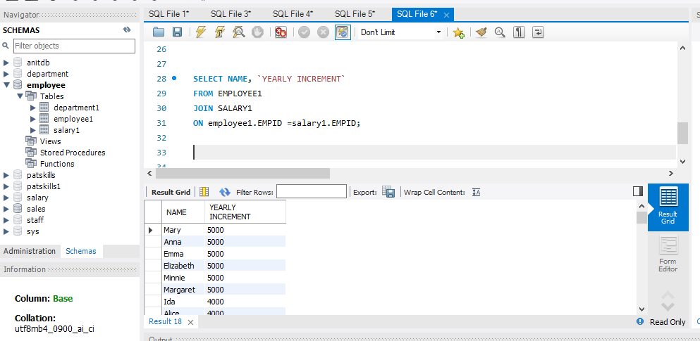

# SQLTASK5
## PERSONAL STATEMENT
### Using the 3 datasets , create 4 business questions using  JOIN, GROUP BY, COUNT AND ORDER BY

### How many employees are in each department?

### Find the designation and number of department that offer "M.TECH"

### Find the departments whose education is "MBA"

### Retrive the "employee names" and their "yearly increment" from the salary and employee table

